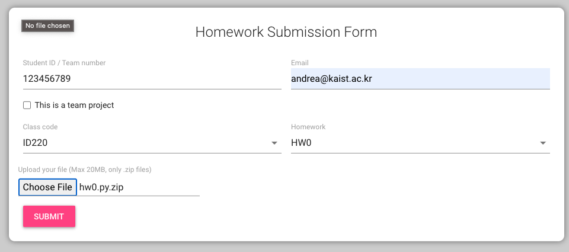

# Homework 0 - Basic Python

Write a python program that requests the user to input a number of cups. Then your script should distribute these cups to have the fewest number of _containers_. These containers have four different sizes: _gallon_, _quart_, _pint_, and _cup_ size. Here how they related to each other

```
1 pint = 2 cups
1 quart = 2 pint
1 gallon = 4 quart
```

Your code should therefore ask for a number of cups and print the result for each of the containers in the format `XX gallons, XX quarts, XX pints, XX cups` where `XX` are integer quantities.

## Example:

If the user has entered 9 as the number of cups. We would print:

`0 gallons, 2 quarts, 0 pints, 1 cup`

Please **note** that the `s` for the plural is removed when there is only 1 unit.

## Grading and Submission

1. The purpose of this homework is for **YOU** to determine whether you have sufficient prerequisites to take this class.
2. Regardless of the quality of your code, if you submit a solution for this exercise (i.e., a non-empty file) you will receive `100 points` for your first in-class activity.
3. To submit this homework, zip your source code (e.g., _main.py_) and submit this resulting file using the [homework submission system](https://homework.prototyping.id). Make sure the zip file is smaller than 20MB. Use _zip_ extensions, not _ALZIP_, _rar_, or other compressions.

<p align="center">

</p>

## Please note that:

1. Only submissions made with the system will be considered (no direct emails to TA or Prof).
2. You can re-submit as many times as you want before the deadline &ndash; we will consider your last submission.
3. Submissions after the deadline are **NOT** accepted.
4. If the file is too large the system won’t allow the submission. Remove from the zip file unnecessary files, and make sure to compress your images.
5. Do not copy from the Internet or colleagues without attribution. Remember the _honor code policy_.
